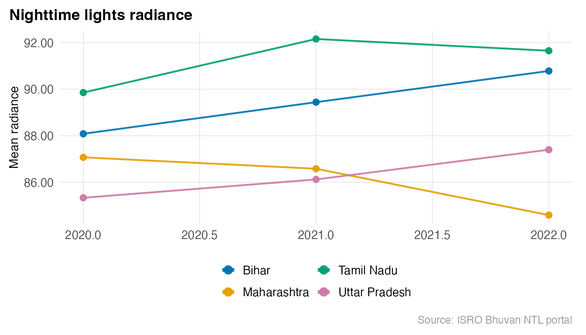
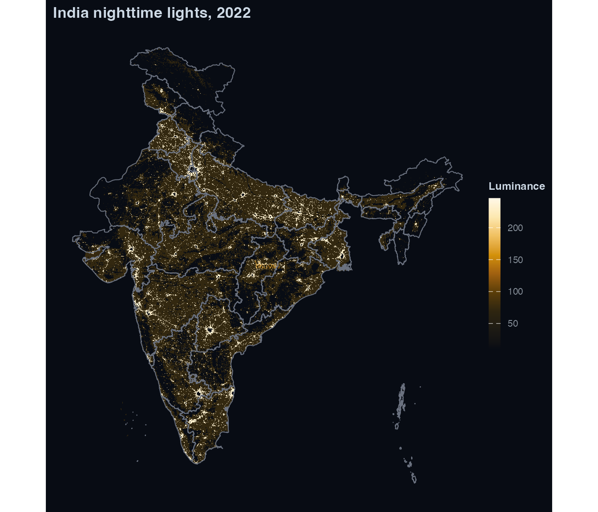
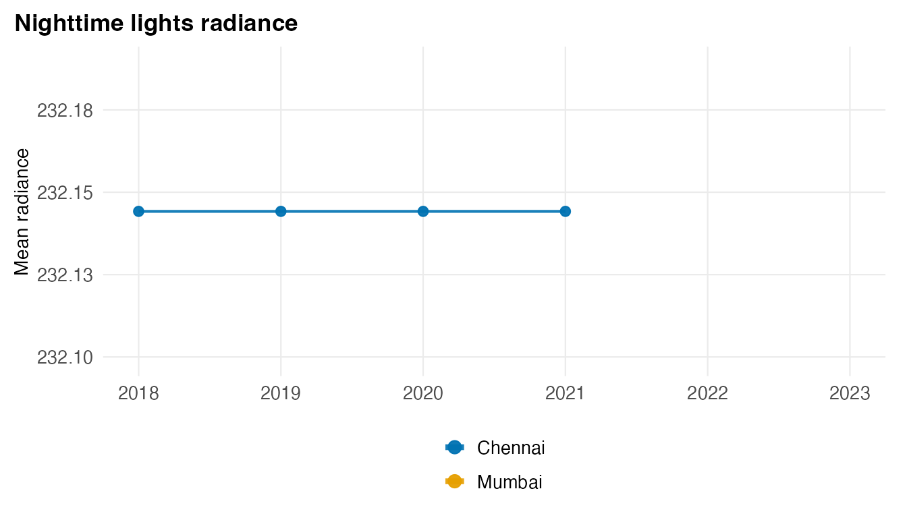
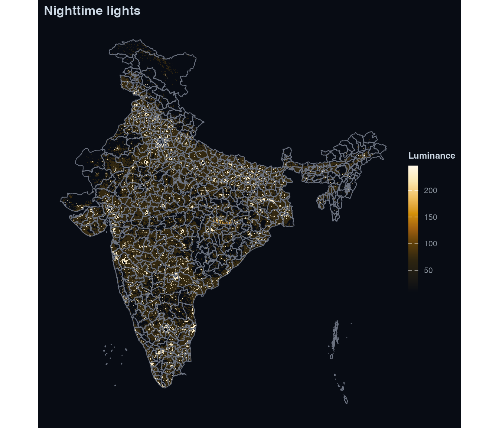

# Custom geometry: district-level NTL with custom boundaries

`lightson` accepts any `sf` polygon layer. The workflow below starts
with the bundled LGD state boundaries, then swaps in district-level
GeoJSONs from [bharatviz](https://github.com/saketlab/bharatviz).

## State-level workflow (bundled boundaries)

``` r

library(lightson)
library(sf)
#> Linking to GEOS 3.13.0, GDAL 3.8.5, PROJ 9.5.1; sf_use_s2() is TRUE

states <- get_india_admin("state")
nrow(states)
#> [1] 36
head(states[, c("state_name", "state_code")])
#> Simple feature collection with 6 features and 2 fields
#> Geometry type: GEOMETRY
#> Dimension:     XY
#> Bounding box:  xmin: 76.7052 ymin: 6.7528 xmax: 97.4129 ymax: 30.7941
#> Geodetic CRS:  WGS 84
#> # A tibble: 6 × 3
#>   state_name        state_code                                          geometry
#>   <chr>             <chr>                                         <GEOMETRY [°]>
#> 1 A & N Islands     35         GEOMETRYCOLLECTION (POLYGON ((92.4043 10.7844, 9…
#> 2 Andhra Pradesh    37         MULTIPOLYGON (((80.7879 15.7605, 80.79048 15.764…
#> 3 Arunachal Pradesh 12         POLYGON ((96.1765 29.3452, 96.1799 29.3075, 96.2…
#> 4 Assam             18         MULTIPOLYGON (((91.5352 25.8839, 91.5304 25.8713…
#> 5 Bihar             10         POLYGON ((84.1093 27.5208, 84.1242 27.5108, 84.1…
#> 6 Chandigarh        04         POLYGON ((76.7723 30.7941, 76.7828 30.7892, 76.7…
```

Download Bhuvan WMS rasters for a subset of years.
[`bhuvan_raster()`](https://saketkc.github.io/lightson/reference/bhuvan_raster.md)
derives the bounding box from the geometry:

``` r

rasters <- bhuvan_raster(states, years = 2020:2022)
#> Using cached: bhuvan_349e9f004c78_2020.tif
#> Using cached: bhuvan_349e9f004c78_2021.tif
#> Using cached: bhuvan_349e9f004c78_2022.tif
names(rasters)
#> [1] "2020" "2021" "2022"
rasters[["2022"]]
#> class       : SpatRaster 
#> size        : 1024, 1024, 1  (nrow, ncol, nlyr)
#> resolution  : 0.0285501, 0.02962432  (x, y)
#> extent      : 68.1776, 97.4129, 6.7528, 37.0881  (xmin, xmax, ymin, ymax)
#> coord. ref. : lon/lat WGS 84 (EPSG:4326) 
#> source      : bhuvan_349e9f004c78_2022.tif 
#> name        : file443945280941_1 
#> min value   :            10.0000 
#> max value   :           245.9732
```

Bhuvan WMS returns RGB visualisation tiles, not physical radiance.
[`bhuvan_raster()`](https://saketkc.github.io/lightson/reference/bhuvan_raster.md)
converts to single-band luminance via
`lum = 0.2126*R + 0.7152*G + 0.0722*B` (ITU-R BT.709). Values are
comparable across years for trend analysis but are not in nW/cm^2/sr.

``` r

panel <- extract_panel(rasters, states, id_col = "state_name")
#> Warning in st_cast.GEOMETRYCOLLECTION(X[[i]], ...): only first part of
#> geometrycollection is retained
head(panel)
#>         region_id year mean_radiance n_pixels
#> 1   A & N Islands 2020      72.73280        1
#> 37  A & N Islands 2021           NaN        0
#> 73  A & N Islands 2022      72.73280        1
#> 2  Andhra Pradesh 2020      89.00605     5425
#> 38 Andhra Pradesh 2021      89.06904     5619
#> 74 Andhra Pradesh 2022      85.62903     9063
```

``` r

library(ggplot2)
sel <- c("Bihar", "Maharashtra", "Tamil Nadu", "Uttar Pradesh")
plot_ntl_trend(
  panel[panel$region_id %in% sel, ],
  region   = sel,
  caption  = "Source: ISRO Bhuvan NTL portal"
)
```



``` r

plot_ntl_map(
  rasters[["2022"]],
  polygons = states,
  title    = "India nighttime lights, 2022"
)
#> Warning: Raster pixels are placed at uneven horizontal intervals and will be shifted
#> ℹ Consider using `geom_tile()` instead.
#> Raster pixels are placed at uneven horizontal intervals and will be shifted
#> ℹ Consider using `geom_tile()` instead.
```



## District-level workflow

``` r

BHARATVIZ <- "https://bharatviz.org"

districts <- tryCatch(
  sf::read_sf(file.path(BHARATVIZ, "India-bhuvan-districts.geojson")),
  error = function(e) NULL
)
if (is.null(districts)) {
  message("bharatviz not reachable -- skipping district examples")
  knitr::opts_chunk$set(eval = FALSE)
}
nrow(districts)
#> [1] 663
```

``` r

rasters_dist <- bhuvan_raster(districts, years = 2018:2023)
#> Using cached: bhuvan_3a578bdafd65_2018.tif
#> Using cached: bhuvan_3a578bdafd65_2019.tif
#> Using cached: bhuvan_3a578bdafd65_2020.tif
#> Using cached: bhuvan_3a578bdafd65_2021.tif
#> Using cached: bhuvan_3a578bdafd65_2022.tif
#> Using cached: bhuvan_3a578bdafd65_2023.tif
names(rasters_dist)
#> [1] "2018" "2019" "2020" "2021" "2022" "2023"
```

``` r

panel_dist <- extract_panel(rasters_dist, districts, id_col = "district_name")
head(panel_dist)
#>      region_id year mean_radiance n_pixels
#> 1     Adilabad 2018      80.62973      687
#> 656   Adilabad 2019      81.94291      589
#> 1311  Adilabad 2020      84.66755      468
#> 1966  Adilabad 2021      84.92001      537
#> 2621  Adilabad 2022      81.22808      957
#> 3276  Adilabad 2023      79.89459     1291
```

``` r

plot_ntl_trend(panel_dist, region = c("Mumbai", "Delhi", "Chennai", "Bengaluru"))
#> Warning: Removed 8 rows containing missing values or values outside the scale range
#> (`geom_line()`).
#> Warning: Removed 8 rows containing missing values or values outside the scale range
#> (`geom_point()`).
```



``` r

plot_ntl_map(rasters_dist[["2022"]], polygons = districts)
#> Warning: Raster pixels are placed at uneven horizontal intervals and will be shifted
#> ℹ Consider using `geom_tile()` instead.
#> Raster pixels are placed at uneven horizontal intervals and will be shifted
#> ℹ Consider using `geom_tile()` instead.
```



### LGD boundaries

``` r

lgd <- sf::read_sf(file.path(BHARATVIZ, "India_LGD_districts.geojson"))
panel_lgd <- extract_panel(rasters_dist, lgd, id_col = "district_name")
head(panel_lgd)
#>               region_id year mean_radiance n_pixels
#> 1    24 Paraganas North 2018     101.40637      384
#> 780  24 Paraganas North 2019      97.81399      369
#> 1559 24 Paraganas North 2020      96.70937      346
#> 2338 24 Paraganas North 2021      98.10729      371
#> 3117 24 Paraganas North 2022     100.81564      386
#> 3896 24 Paraganas North 2023     102.41911      392
```

### Historical census boundaries

``` r

dist_2011 <- sf::read_sf(file.path(BHARATVIZ, "India-2011-districts.geojson"))
panel_2011 <- extract_panel(rasters_dist, dist_2011)
head(panel_2011)
#>      region_id year mean_radiance n_pixels
#> 1     Adilabad 2018      80.75823      676
#> 632   Adilabad 2019      82.08582      580
#> 1263  Adilabad 2020      84.90157      459
#> 1894  Adilabad 2021      84.89411      525
#> 2525  Adilabad 2022      81.16727      945
#> 3156  Adilabad 2023      79.83159     1280
```

[`extract_panel()`](https://saketkc.github.io/lightson/reference/extract_panel.md)
picks the first character column as `region_id` automatically, or pass
`id_col` explicitly.

------------------------------------------------------------------------

## VIIRS path

To use NASA VIIRS rasters, supply an [Earthdata
token](https://urs.earthdata.nasa.gov/):

``` r

token <- earthdata_token()
rasters_viirs <- ntl_download("viirs", region = districts, years = 2018:2023, token = token)
#> Using cached: viirs_3a578bdafd65_2018.tif
#> Using cached: viirs_3a578bdafd65_2019.tif
#> Using cached: viirs_3a578bdafd65_2020.tif
#> Using cached: viirs_3a578bdafd65_2021.tif
#> Using cached: viirs_3a578bdafd65_2022.tif
#> Using cached: viirs_3a578bdafd65_2023.tif
if (length(rasters_viirs) > 0) {
  panel_viirs <- extract_panel(rasters_viirs, districts, id_col = "district_name")
  head(panel_viirs)
}
#>      region_id year mean_radiance n_pixels
#> 1     Adilabad 2018     0.3298444    79913
#> 657   Adilabad 2019     0.3439170    79913
#> 1313  Adilabad 2020     0.3345843    79913
#> 1969  Adilabad 2021     0.4481786    79913
#> 2625  Adilabad 2022     0.6896970    79913
#> 3281  Adilabad 2023     0.8585687    79913
```
