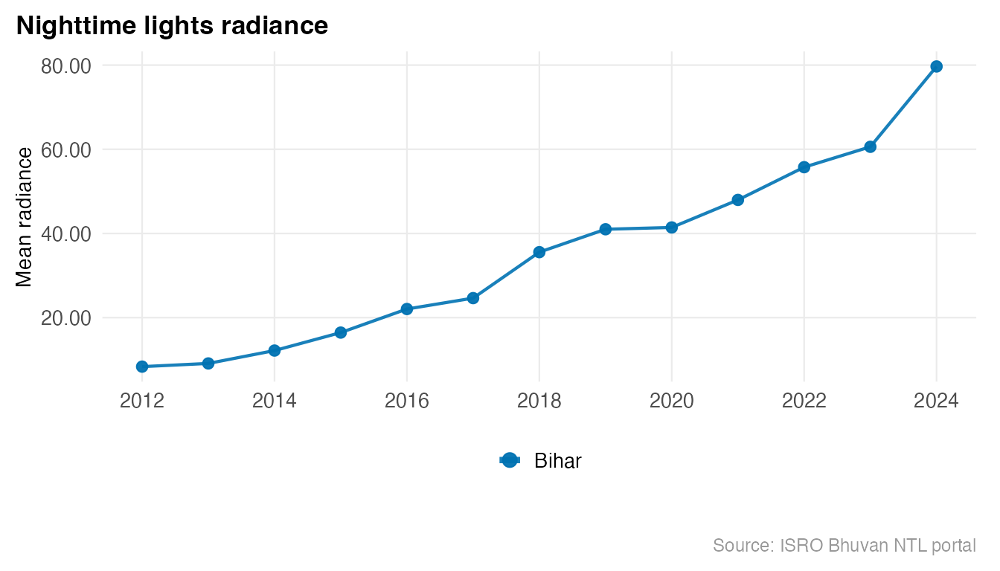
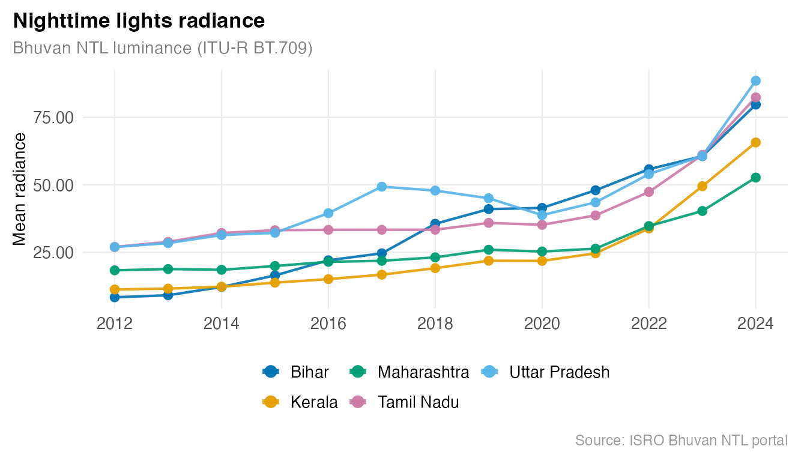
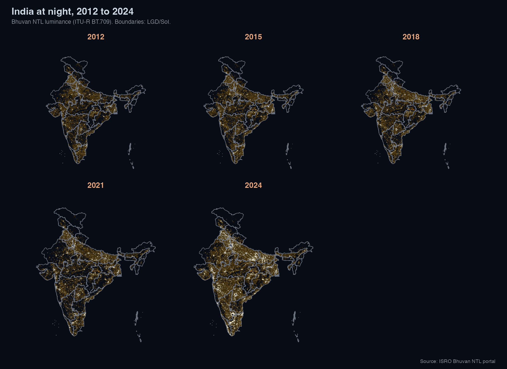

# India state-level NTL with Bhuvan

ISRO’s Bhuvan NTL portal provides pre-aggregated mean radiance for all
Indian states from 2012 to 2024, and WMS raster tiles for any custom
region, with no authentication required.

## All states, all years

``` r

library(lightson)

df <- bhuvan_stats()
#> Warning: Your request spans a collection break in the Bhuvan NTL data:
#> 2012-2023 uses VNP46A4 Collection 1.0 and 2024 onwards uses Collection 2.0.
#> Radiance estimates are not directly comparable across this boundary. Treat any
#> 2023-to-2024 trend as an artefact of the collection change, not a real-world
#> signal.
dim(df)
#> [1] 481   3
head(df)
#>               state year mean_radiance
#> 1 Andaman & Nicobar 2012          2.28
#> 2    Andhra Pradesh 2012         12.05
#> 3 Arunachal Pradesh 2012          0.78
#> 4             Assam 2012         10.81
#> 5             Bihar 2012          8.36
#> 6        Chandigarh 2012       1100.69
```

## Single state time series

``` r

bihar <- bhuvan_stats(state = "BIHAR")
#> Warning: Your request spans a collection break in the Bhuvan NTL data:
#> 2012-2023 uses VNP46A4 Collection 1.0 and 2024 onwards uses Collection 2.0.
#> Radiance estimates are not directly comparable across this boundary. Treat any
#> 2023-to-2024 trend as an artefact of the collection change, not a real-world
#> signal.
bihar
#>    state year mean_radiance
#> 1  Bihar 2012          8.36
#> 2  Bihar 2013          9.12
#> 3  Bihar 2014         12.18
#> 4  Bihar 2015         16.45
#> 5  Bihar 2016         22.05
#> 6  Bihar 2017         24.64
#> 7  Bihar 2018         35.56
#> 8  Bihar 2019         41.00
#> 9  Bihar 2020         41.43
#> 10 Bihar 2021         47.97
#> 11 Bihar 2022         55.75
#> 12 Bihar 2023         60.59
#> 13 Bihar 2024         79.68
```

``` r

library(ggplot2)
plot_ntl_trend(bihar,
  region = "Bihar",
  caption = "Source: ISRO Bhuvan NTL portal"
)
```



Radiance nearly 10x from 2012 to 2024.

## Compare states

``` r

states <- c("Bihar", "Maharashtra", "Tamil Nadu", "Uttar Pradesh", "Kerala")
plot_ntl_trend(
  df[df$state %in% states, ],
  region   = states,
  subtitle = "Bhuvan NTL luminance (ITU-R BT.709)",
  caption  = "Source: ISRO Bhuvan NTL portal"
)
```



## Nighttime India from space, 2012 to 2024

``` r

states_sf <- get_india_admin("state")

years_sel <- c(2012, 2015, 2018, 2021, 2024)
rasters <- bhuvan_raster("IND", years = years_sel, bbox_pad = c(0, 0, 0, 3.5))
#> Warning: Your request spans a collection break in the Bhuvan NTL data:
#> 2012-2023 uses VNP46A4 Collection 1.0 and 2024 onwards uses Collection 2.0.
#> Radiance estimates are not directly comparable across this boundary. Treat any
#> 2023-to-2024 trend as an artefact of the collection change, not a real-world
#> signal.
#> Using cached: bhuvan_9a24aa4b1d43_2012.tif
#> Using cached: bhuvan_9a24aa4b1d43_2015.tif
#> Using cached: bhuvan_9a24aa4b1d43_2018.tif
#> Using cached: bhuvan_9a24aa4b1d43_2021.tif
#> Using cached: bhuvan_9a24aa4b1d43_2024.tif

if (length(rasters) == 0) stop("No rasters downloaded. Check network / Bhuvan WMS.")
```

``` r

plot_ntl_panel(
  rasters,
  polygons = states_sf,
  title    = "India at night, 2012 to 2024",
  subtitle = "Bhuvan NTL luminance (ITU-R BT.709). Boundaries: LGD/SoI.",
  caption  = "Source: ISRO Bhuvan NTL portal",
  ncol     = 3L
)
#> Warning: Raster pixels are placed at uneven horizontal intervals and will be shifted
#> ℹ Consider using `geom_tile()` instead.
#> Raster pixels are placed at uneven horizontal intervals and will be shifted
#> ℹ Consider using `geom_tile()` instead.
#> Raster pixels are placed at uneven horizontal intervals and will be shifted
#> ℹ Consider using `geom_tile()` instead.
#> Raster pixels are placed at uneven horizontal intervals and will be shifted
#> ℹ Consider using `geom_tile()` instead.
#> Raster pixels are placed at uneven horizontal intervals and will be shifted
#> ℹ Consider using `geom_tile()` instead.
#> Raster pixels are placed at uneven horizontal intervals and will be shifted
#> ℹ Consider using `geom_tile()` instead.
#> Raster pixels are placed at uneven horizontal intervals and will be shifted
#> ℹ Consider using `geom_tile()` instead.
#> Raster pixels are placed at uneven horizontal intervals and will be shifted
#> ℹ Consider using `geom_tile()` instead.
#> Raster pixels are placed at uneven horizontal intervals and will be shifted
#> ℹ Consider using `geom_tile()` instead.
```



Each panel uses the same luminance scale anchored at zero, so brightness
is comparable across years. The sharpest gains are in Bihar, UP, and
Odisha after 2015, broadly tracking the [Saubhagya electrification
scheme](https://powermin.gov.in/en/content/saubhagya) (2017-2019).

## Filter by year range

``` r

post_2015 <- bhuvan_stats(years = 2015:2024)
#> Warning: Your request spans a collection break in the Bhuvan NTL data:
#> 2012-2023 uses VNP46A4 Collection 1.0 and 2024 onwards uses Collection 2.0.
#> Radiance estimates are not directly comparable across this boundary. Treat any
#> 2023-to-2024 trend as an artefact of the collection change, not a real-world
#> signal.
nrow(post_2015)
#> [1] 370
```
