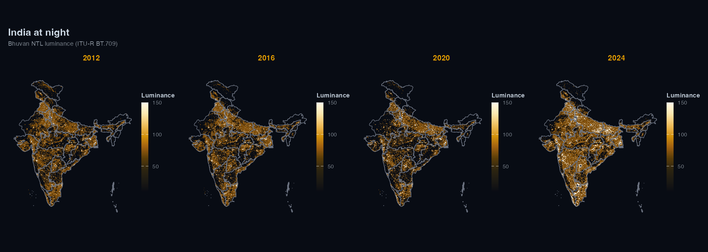

# lightson

Download and analyse nighttime lights satellite data from R.

`lightson` supports two data sources:

- **ISRO Bhuvan NTL**: pre-aggregated state radiance for India
  (2012-2024); WMS raster tiles for any region.
- **NASA VIIRS Black Marble** (VNP46A4): annual composites from 2012,
  global coverage.

The ISRO Bhuvan NTL source does not require any authentication. VIIRS
requires a free NASA Earthdata account.



India at night, 2012-2024

## Installation

``` r

pak::pak("saketkc/lightson")
```

## Usage

### India state trends

``` r

library(lightson)

df <- bhuvan_stats()          # all states, 2012-2024
head(df)
#>        state year mean_radiance
#> 1 Andhra Pradesh 2012      22.4

bihar <- bhuvan_stats(state = "BIHAR")
plot_ntl_trend(bihar, region = "Bihar", caption = "Source: ISRO Bhuvan")
```

### Compare states

``` r

states <- c("Bihar", "Maharashtra", "Tamil Nadu", "Uttar Pradesh", "Kerala")
plot_ntl_trend(
  df[df$state %in% states, ],
  region   = states,
  subtitle = "Bhuvan NTL luminance (ITU-R BT.709)",
  caption  = "Source: ISRO Bhuvan NTL portal"
)
```

### Raster maps

``` r

library(sf)
library(terra)

states_sf <- get_india_admin("state")   # bundled LGD/SoI boundaries, full J&K

rasters <- bhuvan_raster("IND", years = 2022, bbox_pad = c(0, 0, 0, 3.5))
plot_ntl_map(rasters[["2022"]], polygons = states_sf, dark = TRUE)
plot_ntl_map(rasters[["2022"]], polygons = states_sf, palette = "bhuvan")
```

### District-level panel

``` r

districts <- sf::read_sf("https://bharatviz.org/India-bhuvan-districts.geojson")

rasters <- bhuvan_raster(districts, years = 2018:2023)
panel   <- extract_panel(rasters, districts, id_col = "district_name")

head(panel)
#>   region_id year mean_radiance n_pixels
#> 1  Adilabad 2018          14.2     3821

plot_ntl_trend(panel, region = c("Mumbai", "Delhi", "Chennai", "Bengaluru"))
```

[`bhuvan_raster()`](https://saketkc.github.io/lightson/reference/bhuvan_raster.md)
accepts any `sf` object (including your own shapefile/geojson).

## VIIRS

VIIRS gives physical radiance in nW/cm^2/sr, which is useful when you
need calibrated values or coverage outside India.

**Getting a token:**

1.  Create a free account at <https://urs.earthdata.nasa.gov>
2.  Accept the MERIS and Sentinel EULAs under Profile \> EULAs
3.  Go to Profile \> Generate Token and copy the `EDL-...` string
4.  Add it to `~/.Renviron`: `EARTHDATA_TOKEN=EDL-xxxxxxxxxxxxxxxxxxxx`

``` r

# read EARTHDATA_TOKEN from environment
token <- earthdata_token()   
rasters <- ntl_download("viirs", region = "IND", years = 2020:2023, token = token)
panel <- extract_panel(rasters, get_india_admin("state"), id_col = "state_name")
plot_ntl_trend(panel, region = c("Bihar", "Maharashtra"))
```

You can also set `EARTHDATA_USERNAME` and `EARTHDATA_PASSWORD` in
`~/.Renviron` instead and
[`earthdata_token()`](https://saketkc.github.io/lightson/reference/earthdata_token.md)
will fetch the token for you.

## Units and comparability

Bhuvan WMS rasters are RGB visualisation tiles.
[`bhuvan_raster()`](https://saketkc.github.io/lightson/reference/bhuvan_raster.md)
converts them to ITU-R BT.709 luminance (`0.2126R + 0.7152G + 0.0722B`).
The values are dimensionless and can be used for trend analysis, but not
in physical radiance units. Don’t mix them with VIIRS radiance in a
regression without normalising first.

Bhuvan NTL data from 2024 onwards uses VNP46A4 Collection 2.0; 2012-2023
uses Collection 1.0. The two collections use different calibration
algorithms, so estimates aren’t directly comparable across that
boundary. `lightson` warns automatically when a request spans both.
